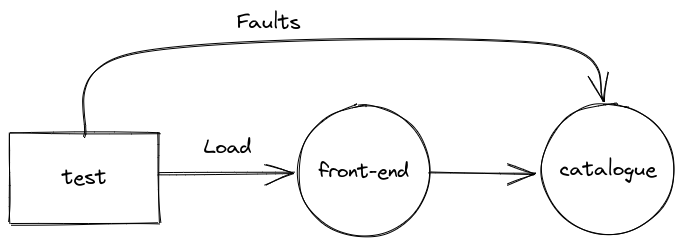

# xk6-disruptor-demo

The purpose of this repository is to offer a step-by-step guide for running [xk6-disruptor](https://github.com/grafana/xk6-disruptor) in a local development environment using a demo application.


## Before you start

This tutorial assumes that you are familiar with Kubernetes concepts such as [deploying applications](https://kubernetes.io/docs/concepts/workloads/) and exposing them using [services](https://kubernetes.io/docs/concepts/services-networking/service/).

Even when will provide all the required commands in this tutorial, it would also be convenient if you have some familiarity with using [kubectl](https://kubernetes.io/docs/reference/kubectl/) for managing applications in Kubernetes.

> :warning: The demo has been tested on Linux, it might not work with other OS.

## The case study
 
 In this demo, we will be working with the [Socks-shop application](https://github.com/microservices-demo/microservices-demo). This application implements a fully functional e-Commerce site that allows users to register, browse the catalog, and buy items. It follows a polyglot microservices-based architecture shown in the figure below. Each microservice has its own API that can be accessed directly using its corresponding Kubernetes service. The front-end service works as a backend for the web interface but also exposes the APIs of other services, working as a kind of API gateway.

 

## Installing xk6-disruptor

xk6-disruptor is a k6 extension. To use it in a k6 test script, it is necessary to use a custom build of k6 that includes it. You can get the binaries for different platforms from the [xk6-disruptor github repository](https://github.com/grafana/xk6-disruptor/releases). Refer to the [Installation Guide](https://k6.io/docs/javascript-api/xk6-disruptor/get-started/installation/) for more information.

> The rest of this tutorial assumes `xk6-disruptor` binary is available in the system path. In other words, you can invoke it just by typing `xk6-disruptor`. If this is not the case, you will have to modify the commands in this tutorial accordingly.

## Setup test environment

For this demo, we will be using a local Kubernetes cluster deployed using [Kind](https://kind.sigs.k8s.io/). Kind is a tool to run local Kubernetes clusters using Docker containers to emulate nodes.

For the setup, you will also need the `kubectl` tool.

### Install kubectl

Follow [official documentation](https://kubernetes.io/docs/tasks/tools/#kubectl) depending on your operating system.

### Install kind

Follow the [official documentation](https://kubernetes.io/docs/tasks/tools/#kubectl) depending on your operating system.

## Create cluster

Create a local cluster with a name `demo` using the config file provided at `manifests\kind-config.yaml`. The resulting cluster will be configured to use the host port `38080` to access the ingress controller (see setup ingress below).

```shell
kind create cluster --name demo --config manifests/kind-config.yaml
```

Output:

```shell
Creating cluster "demo" ...
 ✓ Ensuring node image (kindest/node:v1.24.0) 🖼
 ✓ Preparing nodes 📦  
 ✓ Writing configuration 📜 
 ✓ Starting control-plane 🕹️ 
 ✓ Installing CNI 🔌 
 ✓ Installing StorageClass 💾 
Set kubectl context to "kind-demo"
You can now use your cluster with:

kubectl cluster-info --context kind-demo

Thanks for using kind! 😊
```

> If you get an error message with the reason `Bind for 0.0.0.0:38080 failed: port is already allocated`, it means this port is already in use by another application. You can change the ports used by the cluster editing the [port mapping section](https://kind.sigs.k8s.io/docs/user/configuration/#extra-port-mappings) in the `manifests/kind-config.yaml` file. Remember the port used as you will need it later for accessing the application.

### Setup a service ingress

We will install the nginx ingress controller to expose services to the host machine:

```shell
kubectl apply -f https://raw.githubusercontent.com/kubernetes/ingress-nginx/main/deploy/static/provider/kind/deploy.yaml
```

Output (some omitted for brevity):

```shell
namespace/ingress-nginx created
serviceaccount/ingress-nginx created
serviceaccount/ingress-nginx-admission created
...
```

### Set access to the cluster

The xk6-disruptor needs to interact with the Kubernetes cluster on which the application is running. To do so, you must have the credentials to access the cluster in a [kubeconfig file](https://kubernetes.io/docs/tasks/access-application-cluster/configure-access-multiple-clusters/).

Use the following command to set this configuration:

```shell
kind export kubeconfig --name demo
```

Output:

```shell
Set kubectl context to "kind-demo"
```

## Install the Socks Shop application

The Socks Shop application can be deployed on a Kubernetes cluster applying the manifest with all the required resources using the following command:

```shell
kubectl apply -f https://raw.githubusercontent.com/microservices-demo/microservices-demo/master/deploy/kubernetes/complete-demo.yaml
```

Output (some output omitted for brevity):

```shell
deployment.apps/carts created
service/carts created
deployment.apps/carts-db created
service/carts-db created
...
```

Notice the Socks Shop application is deployed in the `sock-shop` namespace. To facilitate accessing the application's resources you can set this namespace as the default for `kubectl` with the following command:

```shell
kubectl config set-context --current --namespace sock-shop
```

Output:

```shell
Context "kind-demo" modified.
```

The application can take several minutes to fully deploy. You can check the status of the pods using the following command:
```shel
kubectl wait pod --for=condition=Ready --all --timeout=60s
```

It is poosible you receive an output similar to the one shown below, on which some pods are not yet ready. Repeat the command above until all pods return `condition met`. You can also increase the maximum time the command will wait for the condition to be satisfied by changing the `--timeout` parameter.

```
pod/carts-7bbf9dc945-9fpbr condition met
pod/carts-db-67f744dd5f-8htrz condition met
pod/catalogue-db-6b55d8cdb7-4lrlq condition met
pod/front-end-7f5c844b4c-f8zj6 condition met
pod/orders-74f65597c5-9d6pp condition met
pod/orders-db-b76d8c54c-jd8lj condition met
pod/queue-master-9fc44d68d-mgg9s condition met
pod/rabbitmq-6576689cc9-9gs5t condition met
pod/session-db-695f7fd48f-bslkm condition met
pod/shipping-79c568cddc-qzjlp condition met
pod/user-db-b8dfb847c-gl8zc condition met
timed out waiting for the condition on pods/catalogue-6479dbb5bd-dzlnb
timed out waiting for the condition on pods/payment-c7df5b49-kt8jk
timed out waiting for the condition on pods/user-79dddf5cc9-wcrbs
````

### Expose the Front-end service API

We will create a ingress mapping requests to the local host to the front-end service. 

```shell
kubectl apply -f manifests/front-end-ingress.yaml
```

Output:

```shell
ingress.networking.k8s.io/front-end-ingress created
```

You can test the access to the `front-end` service with the following command:

```shell
curl -s localhost:38080/front-end/catalogue/3395a43e-2d88-40de-b95f-e00e1502085b
```

Output:

```json
{"id":"3395a43e-2d88-40de-b95f-e00e1502085b","name":"Colourful","description":"proident occaecat irure et excepteur labore minim nisi amet irure","imageUrl":["/catalogue/images/colourful_socks.jpg","/catalogue/images/colourful_socks.jpg"],"price":18,"count":438,"tag":["brown","blue"]}
```

Notice that the URL uses `localhost` as the IP address and `38080` as the port. This is the port exposed by the cluster to access the ingress.
If you changed the port mapping in kind you must use that port.

Also, notice the URL includes the `/front-end` prefix which is used by the ingress for mapping requests to the `front-end` service.

> Using an ingress does not work for accessing the front-end service from a browser, as the URL re-write rule breaks the links to in the HTML document.


## The test script

Let's start with a simple chaos test [scripts/test-front-end.js](scripts/test-front-end.js). The test applies a load to the Front-end service requesting the description of products from the Catalogue service. At the same time, it injects faults in the Catalogue service.

The faults will cause delays in the requests (up to 100ms over the normal response time) and eventually return the HTTP 500 errors. 



> Notice the injection of faults in the test is conditioned to the environment variable `INJECT_FAULTS` being defined with a value `1`. If this variable is not defined or if its value is not `1`, the fault injection is skipped. This allows running the same test with and without faults to facilitate comparison.


### Setup environment

The `test-front-end.js` script expects the URL to the `front-end` service in the `SVC_URL` environment variable.

```shell
SVC_URL="localhost:38080/front-end"
```

### Run baseline

We will first run the test without injecting faults.

```shell
xk6-disruptor run --env SVC_URL=$SVC_URL scripts/test-front-end.js
```

You should get an output similar to the one shown below:

```
          /\      |‾‾| /‾‾/   /‾‾/   
     /\  /  \     |  |/  /   /  /    
    /  \/    \    |     (   /   ‾‾\  
   /          \   |  |\  \ |  (‾)  | 
  / __________ \  |__| \__\ \_____/ .io

  execution: local
     script: scripts/test-front-end.js
     output: -

  scenarios: (100.00%) 2 scenarios, 101 max VUs, 10m30s max duration (incl. graceful stop):
           * inject: 1 iterations shared among 1 VUs (maxDuration: 10m0s, exec: injectFaults, gracefulStop: 30s)
           * load: 20.00 iterations/s for 1m0s (maxVUs: 5-100, exec: requestProduct, gracefulStop: 30s)


running (01m00.0s), 000/006 VUs, 1202 complete and 0 interrupted iterations
inject ✓ [======================================] 1 VUs        00m00.0s/10m0s  1/1 shared iters
load   ✓ [======================================] 000/005 VUs  1m0s            20.00 iters/s

     ✓ No errors

     checks.........................: 100.00% ✓ 1201      ✗ 0   
     data_received..................: 691 kB  12 kB/s
     data_sent......................: 165 kB  2.7 kB/s
     http_req_blocked...............: avg=17.06µs min=6.07µs  med=9.82µs   max=1.08ms   p(90)=13.52µs  p(95)=15.07µs 
     http_req_connecting............: avg=4.44µs  min=0s      med=0s       max=485.07µs p(90)=0s       p(95)=0s      
     http_req_duration..............: avg=9.37ms  min=5.34ms  med=8.13ms   max=221.39ms p(90)=10.38ms  p(95)=11.29ms 
       { expected_response:true }...: avg=9.37ms  min=5.34ms  med=8.13ms   max=221.39ms p(90)=10.38ms  p(95)=11.29ms 
     http_req_failed................: 0.00%   ✓ 0         ✗ 1201
     http_req_receiving.............: avg=468µs   min=73.98µs med=391.43µs max=46.01ms  p(90)=662.87µs p(95)=786.08µs
     http_req_sending...............: avg=53.04µs min=29.5µs  med=49.57µs  max=189.28µs p(90)=69.32µs  p(95)=75.64µs 
     http_req_tls_handshaking.......: avg=0s      min=0s      med=0s       max=0s       p(90)=0s       p(95)=0s      
     http_req_waiting...............: avg=8.85ms  min=5.19ms  med=7.66ms   max=220.09ms p(90)=9.71ms   p(95)=10.69ms 
     http_reqs......................: 1201    20.011126/s
     iteration_duration.............: avg=9.86ms  min=48.58µs med=8.62ms   max=222.21ms p(90)=10.89ms  p(95)=11.97ms 
     iterations.....................: 1202    20.027788/s
     vus............................: 5       min=5       max=5 
     vus_max........................: 6       min=6       max=6 
```

Notice these two metrics from the output above:

```shell
checks.........................: 100.00% ✓ 1201      ✗ 0
http_req_duration..............: avg=9.37ms  min=5.34ms  med=8.13ms   max=221.39ms p(90)=10.38ms  p(95)=11.29ms
```

The `checks` metric indicates `100%` of requests were successful. The percentile 95 of `http_req_duration` is `11.29ms `.
These metrics will be the baseline for the test.

### Run chaos test

We now will set the `INJECT_FAULTS` environment variable to enable the fault injection and will run the test again:

```shell
xk6-disruptor run --env SVC_URL=$SVC_URL --env INJECT_FAULTS=1 scripts/test-front-end.js
```

You should get an output similar to the one below:

```
          /\      |‾‾| /‾‾/   /‾‾/   
     /\  /  \     |  |/  /   /  /    
    /  \/    \    |     (   /   ‾‾\  
   /          \   |  |\  \ |  (‾)  | 
  / __________ \  |__| \__\ \_____/ .io

  execution: local
     script: scripts/test-front-end.js
     output: -

  scenarios: (100.00%) 2 scenarios, 101 max VUs, 10m30s max duration (incl. graceful stop):
           * inject: 1 iterations shared among 1 VUs (maxDuration: 10m0s, exec: injectFaults, gracefulStop: 30s)
           * load: 20.00 iterations/s for 1m0s (maxVUs: 5-100, exec: requestProduct, gracefulStop: 30s)


running (01m05.3s), 000/006 VUs, 1201 complete and 0 interrupted iterations
inject ✓ [======================================] 1 VUs        01m05.3s/10m0s  1/1 shared itersaverage
load   ✓ [======================================] 000/005 VUs  1m0s            20.00 iters/s

     ✗ No errors
      ↳  89% — ✓ 1073 / ✗ 127

     checks.........................: 89.41% ✓ 1073      ✗ 127 
     data_received..................: 664 kB 10 kB/s
     data_sent......................: 164 kB 2.5 kB/s
     http_req_blocked...............: avg=18.04µs  min=5.95µs  med=10.28µs  max=892.64µs p(90)=13.84µs  p(95)=17.08µs 
     http_req_connecting............: avg=4.77µs   min=0s      med=0s       max=699.49µs p(90)=0s       p(95)=0s      
     http_req_duration..............: avg=101.43ms min=5.78ms  med=109.45ms max=125.46ms p(90)=112.72ms p(95)=113.67ms
       { expected_response:true }...: avg=101.43ms min=5.78ms  med=109.45ms max=125.46ms p(90)=112.72ms p(95)=113.67ms
     http_req_failed................: 0.00%  ✓ 0         ✗ 1200
     http_req_receiving.............: avg=482.26µs min=80.69µs med=392.02µs max=13.55ms  p(90)=741.59µs p(95)=878.89µs
     http_req_sending...............: avg=55.72µs  min=28.08µs med=50.63µs  max=972.47µs p(90)=70.38µs  p(95)=82.15µs 
     http_req_tls_handshaking.......: avg=0s       min=0s      med=0s       max=0s       p(90)=0s       p(95)=0s      
     http_req_waiting...............: avg=100.9ms  min=5.52ms  med=109.02ms max=125.12ms p(90)=112.12ms p(95)=112.82ms
     http_reqs......................: 1200   18.376378/s
     iteration_duration.............: avg=156.23ms min=6.25ms  med=109.94ms max=1m5s     p(90)=113.3ms  p(95)=114.35ms
     iterations.....................: 1201   18.391692/s
     vus............................: 1      min=1       max=6 
     vus_max........................: 6      min=6       max=6 
```

Notice the change in the baseline metrics:

```
checks.........................: 89.41% ✓ 1073      ✗ 127 
http_req_duration..............: avg=101.43ms min=5.78ms  med=109.45ms max=125.46ms p(90)=112.72ms p(95)=113.67ms
```

The `checks` metric now shows that the number of successful requests was nearly `90%`, indicating that roughly `10%` of requests failed, as expected.
Also, the percentile 95 of the `http_req_duration` is now `113.67ms`, reflecting the `100ms` added by the fault injection.

## Next steps

* Learn more [about k6 and load testing](https://github.com/grafana/k6-learn).
