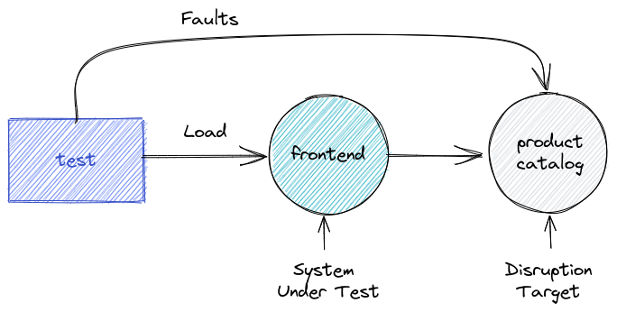

## Online Boutique demo

This demo shows how to inject gRPC faults into a Kubernetes service.


## Install the Online Boutique application

First, let's create a namespace to isolate the application:

```shell
kubectl create namespace boutique
```
Output:

```shell
namespaces/boutique created
```

Set this namespace as the default for the `kubectl` commands:

```shell
kubectl config set-context --current --namespace boutique
```

Output:

```shell
Context "kind-demo" modified.
```

Now, we can deploy the Online Boutique application applying the manifest with all the required resources using the following command:

```shell
kubectl apply -f https://raw.githubusercontent.com/GoogleCloudPlatform/microservices-demo/main/release/kubernetes-manifests.yaml
```

Output (some output omitted for brevity):
```shell
deployment.apps/emailservice created
service/emailservice created
deployment.apps/checkoutservice created
service/checkoutservice created
...
```

The application can take several minutes to fully deploy. You can check the status of the pods using the following command:
```shel
kubectl wait pod --for=condition=Ready --all --timeout=60s
```

Output (some output omitted for brevity):
```
pod/adservice-c9c78c898-f2dlf condition met
pod/cartservice-5588f54cf5-q8dzf condition met
pod/checkoutservice-78c5469948-22gpw condition met
pod/currencyservice-fb99f5cf4-hm5bf condition met
pod/emailservice-5cb89fd8-htbgf condition met
...
```

It is possible you receive an output similar to the one shown below, on which some pods are not yet ready. Repeat the command above until all pods return `condition met`. You can also increase the maximum time the command will wait for the condition to be satisfied by changing the `--timeout` parameter.

```
timed out waiting for the condition on pods/paymentservice-858776b848-rwxwp
```

### Expose the Front-end service API

We will create a ingress mapping requests to the local host to the front-end service. 

```shell
kubectl apply -f manifests/frontend-ingress.yaml
```

Output:

```shell
ingress.networking.k8s.io/frontend-ingress created
```

## The test script

Let's start with a simple test [scripts/test-frontend.js](scripts/test-frontend.js). The test applies a load to the frontend service requesting the description of products from the Catalogue service. At the same time, it injects faults in the product catalog service.

The faults will cause delays in the requests (up to 100ms over the normal response time) and eventually return the HTTP 500 errors. 



> Notice the injection of faults in the test is conditioned to the environment variable `INJECT_FAULTS` being defined with a value `1`. If this variable is not defined or if its value is not `1`, the fault injection is skipped. This allows running the same test with and without faults to facilitate comparison.


### Setup environment

The `test-frontend.js` script expects the URL to the `frontend` service in the `SVC_URL` environment variable.

```shell
SVC_URL="localhost:38080"
```

### Run baseline

We will first run the test without injecting faults.

```shell
xk6-disruptor run --env SVC_URL=$SVC_URL scripts/test-frontend.js
```

<details>

<summary>

The `checks` metric in the output indicates `100%` of requests were successful:

```
✓ checks.........................: 100.00% ✓ 599       ✗ 0  
```

(click for detailed output)
</summary>


```
          /\      |‾‾| /‾‾/   /‾‾/   
     /\  /  \     |  |/  /   /  /    
    /  \/    \    |     (   /   ‾‾\  
   /          \   |  |\  \ |  (‾)  | 
  / __________ \  |__| \__\ \_____/ .io

  execution: local
     script: scripts/test-frontend.js
     output: -

  scenarios: (100.00%) 2 scenarios, 101 max VUs, 10m30s max duration (incl. graceful stop):
           * inject: 1 iterations shared among 1 VUs (maxDuration: 10m0s, exec: injectFaults, gracefulStop: 30s)
           * load: 20.00 iterations/s for 30s (maxVUs: 5-100, exec: requestProduct, gracefulStop: 30s)


running (00m30.0s), 000/008 VUs, 600 complete and 0 interrupted iterations
inject ✓ [======================================] 1 VUs        00m00.0s/10m0s  1/1 shared iters
load   ✓ [======================================] 000/007 VUs  30s             20.00 iters/s

     ✓ No errors

   ✓ checks.........................: 100.00% ✓ 599       ✗ 0  
     data_received..................: 4.8 MB  159 kB/s
     data_sent......................: 59 kB   2.0 kB/s
     dropped_iterations.............: 2       0.066636/s
     http_req_blocked...............: avg=18.13µs  min=6.75µs  med=10.65µs  max=803.56µs p(90)=14.25µs  p(95)=15.7µs  
     http_req_connecting............: avg=4.86µs   min=0s      med=0s       max=535.62µs p(90)=0s       p(95)=0s      
     http_req_duration..............: avg=38.28ms  min=9.42ms  med=14.31ms  max=351.56ms p(90)=103.68ms p(95)=156.03ms
       { expected_response:true }...: avg=38.28ms  min=9.42ms  med=14.31ms  max=351.56ms p(90)=103.68ms p(95)=156.03ms
     http_req_failed................: 0.00%   ✓ 0         ✗ 599
     http_req_receiving.............: avg=986.56µs min=91.67µs med=148.29µs max=96.02ms  p(90)=361.35µs p(95)=510.14µs
     http_req_sending...............: avg=51.67µs  min=25.68µs med=46.48µs  max=235.83µs p(90)=67.49µs  p(95)=78.85µs 
     http_req_tls_handshaking.......: avg=0s       min=0s      med=0s       max=0s       p(90)=0s       p(95)=0s      
     http_req_waiting...............: avg=37.24ms  min=9.14ms  med=14.08ms  max=348.28ms p(90)=103.4ms  p(95)=155.42ms
     http_reqs......................: 599     19.957552/s
     iteration_duration.............: avg=38.6ms   min=74.76µs med=14.74ms  max=351.92ms p(90)=103.96ms p(95)=156.41ms
     iterations.....................: 600     19.99087/s
     vus............................: 7       min=5       max=7
     vus_max........................: 8       min=6       max=8
```
</details>

### Run chaos test

We now will set the `INJECT_FAULTS` environment variable to enable the fault injection and will run the test again:

```shell
xk6-disruptor run --env SVC_URL=$SVC_URL --env INJECT_FAULTS=1 scripts/test-frontend.js
```

Notice the change with respect of the baseline:

<details>

<summary>

```
✗ checks.........................: 90.47% ✓ 532       ✗ 56
```

The `checks` metric now shows that the number of successful requests was `90%`, indicating that roughly `10%` of requests failed, as expected.

Also, notice the message `ERRO[0062] some thresholds have failed` indicating the ratio of successful checks is below the acceptance level of `97%` and therefore the test failed.

(click for detailed output)

</summary>


```
          /\      |‾‾| /‾‾/   /‾‾/   
     /\  /  \     |  |/  /   /  /    
    /  \/    \    |     (   /   ‾‾\  
   /          \   |  |\  \ |  (‾)  | 
  / __________ \  |__| \__\ \_____/ .io

  execution: local
     script: scripts/test-frontend.js
     output: -

  scenarios: (100.00%) 2 scenarios, 101 max VUs, 10m30s max duration (incl. graceful stop):
           * inject: 1 iterations shared among 1 VUs (maxDuration: 10m0s, exec: injectFaults, gracefulStop: 30s)
           * load: 20.00 iterations/s for 30s (maxVUs: 5-100, exec: requestProduct, gracefulStop: 30s)


running (00m50.7s), 000/018 VUs, 589 complete and 0 interrupted iterations
inject ✓ [======================================] 1 VUs        00m50.7s/10m0s  1/1 shared iters
load   ✓ [======================================] 000/017 VUs  30s             20.00 iters/s

     ✗ No errors
      ↳  90% — ✓ 532 / ✗ 56

   ✗ checks.........................: 90.47% ✓ 532       ✗ 56  
     data_received..................: 4.1 MB 80 kB/s
     data_sent......................: 58 kB  1.1 kB/s
     dropped_iterations.............: 12     0.236582/s
     http_req_blocked...............: avg=23.8µs   min=5.77µs  med=10.32µs  max=603.29µs p(90)=14.95µs  p(95)=22.39µs 
     http_req_connecting............: avg=8.96µs   min=0s      med=0s       max=453.57µs p(90)=0s       p(95)=0s      
     http_req_duration..............: avg=209.97ms min=1.93ms  med=139.34ms max=1.33s    p(90)=483.78ms p(95)=586.19ms
       { expected_response:true }...: avg=228.55ms min=9.8ms   med=185.42ms max=1.33s    p(90)=485.66ms p(95)=587.06ms
     http_req_failed................: 9.52%  ✓ 56        ✗ 532 
     http_req_receiving.............: avg=1.18ms   min=71.1µs  med=184.24µs max=96.73ms  p(90)=415.37µs p(95)=557.4µs 
     http_req_sending...............: avg=49.68µs  min=25.66µs med=45.07µs  max=262.88µs p(90)=66.87µs  p(95)=78.91µs 
     http_req_tls_handshaking.......: avg=0s       min=0s      med=0s       max=0s       p(90)=0s       p(95)=0s      
     http_req_waiting...............: avg=208.73ms min=1.73ms  med=138.9ms  max=1.33s    p(90)=483.57ms p(95)=585.94ms
     http_reqs......................: 588    11.592525/s
     iteration_duration.............: avg=296.12ms min=2.17ms  med=139.79ms max=50.72s   p(90)=484.77ms p(95)=586.97ms
     iterations.....................: 589    11.61224/s
     vus............................: 1      min=1       max=18
     vus_max........................: 18     min=6       max=18

ERRO[0052] some thresholds have failed 
```
</details>

This results seems to indicate that the frontend service is not recovering from faults in the requests to the product catalog service.

### Fix the issue

After the results of the fault injection test revealed that the frontend service is not recovering from faults in the requests to the product catalog service, a [fix was implemented](https://github.com/grafana/microservices-demo/pull/1). This fix adds automatic retries to the requests to the catalog product service.

Let's try this solution to validate if it effectively solves the problem.

We first will need to update the frontend service's deployment with an [image that implements the fix](https://github.com/grafana/microservices-demo/pkgs/container/microservices-demo%2Fproductcatalogservice).

```shell
kubectl set image deployment frontend server=ghcr.io/grafana/microservices-demo/frontend:retry-aborted-requests
```

Output:
```
deployment.apps/frontend image updated
```

Let's run the test again:

```shell
xk6-disruptor run --env SVC_URL=$SVC_URL --env INJECT_FAULTS=1 scripts/test-front-end.js
```

<details>

<summary>

In the Output we can see now the `checks` metric shows a success rate of almost `100%`, and the threshold has not failed, confirming the fix works as expected.

```
✓ checks.........................: 99.82% ✓ 581       ✗ 1
```

(click for detailed output)

</summary>

```shell
          /\      |‾‾| /‾‾/   /‾‾/   
     /\  /  \     |  |/  /   /  /    
    /  \/    \    |     (   /   ‾‾\  
   /          \   |  |\  \ |  (‾)  | 
  / __________ \  |__| \__\ \_____/ .io

  execution: local
     script: scripts/test-frontend.js
     output: -

  scenarios: (100.00%) 2 scenarios, 101 max VUs, 10m30s max duration (incl. graceful stop):
           * inject: 1 iterations shared among 1 VUs (maxDuration: 10m0s, exec: injectFaults, gracefulStop: 30s)
           * load: 20.00 iterations/s for 30s (maxVUs: 5-100, exec: requestProduct, gracefulStop: 30s)


running (00m51.1s), 000/025 VUs, 583 complete and 0 interrupted iterations
inject ✓ [======================================] 1 VUs        00m51.1s/10m0s  1/1 shared iters
load   ✓ [======================================] 000/024 VUs  30s             20.00 iters/s

     ✗ No errors
      ↳  99% — ✓ 581 / ✗ 1

   ✓ checks.........................: 99.82% ✓ 581       ✗ 1

  data_received..................: 4.5 MB 88 kB/s
  data_sent......................: 58 kB  1.1 kB/s
  dropped_iterations.............: 19     0.372007/s
  http_req_blocked...............: avg=30.91µs  min=6.7µs   med=9.91µs   max=1.93ms   p(90)=13.38µs  p(95)=19.7µs  
  http_req_connecting............: avg=15.05µs  min=0s      med=0s       max=1.77ms   p(90)=0s       p(95)=0s      
  http_req_duration..............: avg=553.63ms min=3.18ms  med=489.76ms max=1.99s    p(90)=1.08s    p(95)=1.23s   
    { expected_response:true }...: avg=554.58ms min=9.27ms  med=489.82ms max=1.99s    p(90)=1.08s    p(95)=1.23s   
  http_req_failed................: 0.17%  ✓ 1         ✗ 581 
  http_req_receiving.............: avg=977.79µs min=62.11µs med=211.15µs max=99.26ms  p(90)=588.15µs p(95)=844.62µs
  http_req_sending...............: avg=46.92µs  min=25.48µs med=43.06µs  max=265.56µs p(90)=58.94µs  p(95)=69.11µs 
  http_req_tls_handshaking.......: avg=0s       min=0s      med=0s       max=0s       p(90)=0s       p(95)=0s      
  http_req_waiting...............: avg=552.6ms  min=2.95ms  med=489.21ms max=1.98s    p(90)=1.08s    p(95)=1.23s   
  http_reqs......................: 582    11.395172/s
  iteration_duration.............: avg=640.66ms min=4.02ms  med=490.09ms max=51.07s   p(90)=1.08s    p(95)=1.23s   
  iterations.....................: 583    11.414751/s
  vus............................: 1      min=1       max=25
  vus_max........................: 25     min=6       max=25
```

</details>

## Next steps

Lear more about fault injection using [xk6-disruptor](https://k6.io/docs/javascript-api/xk6-disruptor/)